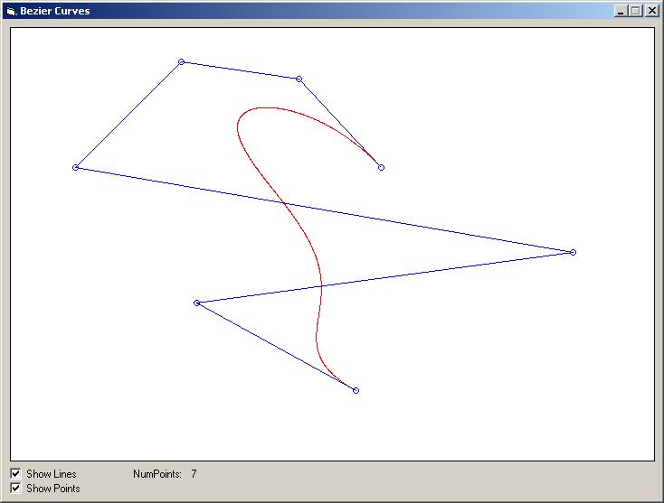



## Bezier Curve \(Infinite number of points\)

### Description

This code uses a recursive function to generate a Bezier curve, based on any number of control points.

It also have an easy-to-use interface to control the curves.
 
### More Info
 
The main curve-code is placed in a class module for easy modular use in any application. It has a few functions to set up the curve and return coordinates.

             |
---                |---
**Submitted On**   |2009-03-30 12:10:18
**By**             |[Daniel Hansson](https://github.com/Planet-Source-Code/PSCIndex/blob/master/ByAuthor/daniel-hansson.md)
**Level**          |Advanced
**User Rating**    |5.0 (20 globes from 4 users)
**Compatibility**  |VB 6\.0
**Category**       |[Graphics](https://github.com/Planet-Source-Code/PSCIndex/blob/master/ByCategory/graphics__1-46.md)
**World**          |[Visual Basic](https://github.com/Planet-Source-Code/PSCIndex/blob/master/ByWorld/visual-basic.md)
**Archive File**   |[Bezier\_Cur2148103302009\.zip](https://github.com/Planet-Source-Code/daniel-hansson-bezier-curve-infinite-number-of-points__1-71925/archive/master.zip)

### API Declarations

No API's are used, but for easy speed up I recommend using SetPixel instead of Pset

